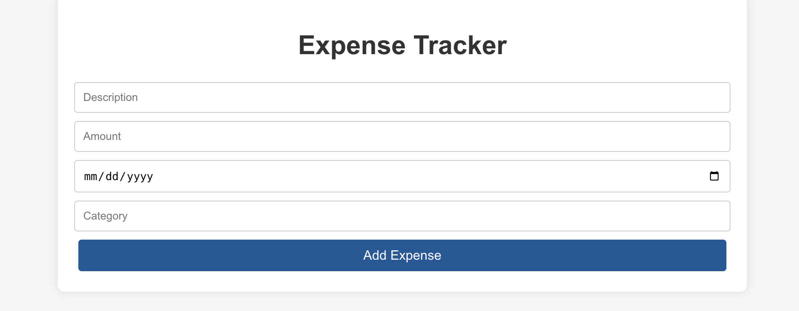

# Expense Tracker

A web application designed to help users track their expenses. The app allows users to create, view, update, and delete expense records.

---

### Deployed App
[Click here to view the deployed app](https://incredible-churros-516c2f.netlify.app/)

## Screenshot

---

## Description

### About the App
The **Expense Tracker App** focuses on full CRUD operations:
- **Create** new expense records.
- **View** existing expense records.
- **Update** expense records as needed.
- **Delete** expense records that are no longer relevant.

### Why I Built It
I built this application for users who want to keep track of their expenses in a simple and efficient manner.

---

## Attributions

This app was built using the following tools and resources:
- **React**
- **Node.js**
- **Express.js**
- **MongoDB**
- **Mongoose**
- **CSS**

---

## Technologies Used

- **Frontend**: React, CSS
- **Backend**: Node.js, Express.js
- **Database**: MongoDB, Mongoose
- **Version Control**: Git and GitHub

---

## Next Steps

Here are some planned future enhancements for the Expense Tracker:
1. **User Authentication**: Add user authentication to allow multiple users to manage their own expenses.
2. **Category Analytics**: Provide insights into spending by category.
3. **Mobile App**: Develop a mobile version of the app for on-the-go expense tracking.

---